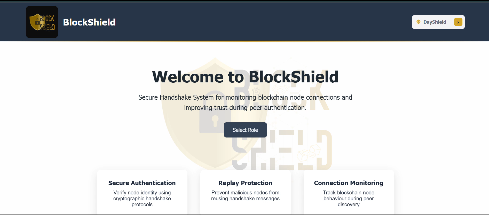

# 🔐 Secure Handshake - BlockShield  
### Strengthening Blockchain Node Authentication  

---

## 📌 Overview  

**Secure Handshake** is a final-year cybersecurity project designed to enhance the security of blockchain node communication during the **handshake phase**.  

The system introduces an additional security layer that prevents unauthorized access, detects malicious behavior, and ensures trust between nodes before communication begins.  

---

## 🚨 Problem Statement  

Traditional blockchain networks allow nodes to establish connections during the handshake phase without strong identity verification.  

This exposes systems to threats such as:  

- Node impersonation  
- Replay attacks  
- Unauthorized network access  
- Malicious node injection  

---

## 🎯 Objectives  

- Strengthen node authentication during handshake  
- Prevent replay and impersonation attacks  
- Implement secure login with OTP verification  
- Enforce Role-Based Access Control (RBAC)  
- Provide real-time monitoring and anomaly detection  
- Visualize system activity through dashboards  

---

## ⚙️ Key Features  

### 🔑 Authentication & Access Control  
- Secure login system  
- OTP-based verification  
- Role-Based Access Control (RBAC)  

### 🔗 Secure Handshake Mechanism  
- Node identity validation  
- Protection against replay attacks  
- Pre-connection verification layer  

### 📊 Monitoring & Detection  
- Real-time event logging  
- Anomaly detection system  
- Alert and monitoring dashboards  

### 🖥️ Interactive Frontend  
- Role-based dashboards  
- Clean UI with theme support  
- Login → OTP → Dashboard workflow  

### 🧪 Demo Module  
- Wallet signing demonstration  
- Simulated blockchain interaction  

---

## 🧰 Tech Stack  

### Frontend  
- React  
- Vite  
- TypeScript  
- CSS  

### Backend  
- Node.js  
- Express  

### Other Tools  
- Git & GitHub  
- REST APIs  
- Blockchain test environment (simulated/demo)  

---

## 📁 Project Structure  

```
secure-handshake/
│
├── backend/        # Backend APIs and security logic
├── frontend/       # React frontend application
├── demo/           # Wallet signing demo
├── docs/           # (Optional) screenshots, diagrams
└── README.md
```

---

## 🚀 Getting Started  

### 🔹 Prerequisites  

- Node.js (v18 or higher)  
- npm (v9 or higher)  
- Git  

---

### 🔹 Run Backend  

```bash
cd backend
npm install
npm start
```

---

### 🔹 Run Frontend  

```bash
cd frontend
npm install
npm run dev
```

---

### 🔹 Access Application  

```
Frontend: http://localhost:5173  
Backend:  http://localhost:4000  
```

---

## 🔧 Environment Configuration (.env)

Create a `.env` file inside the `backend` folder:

```env
PORT=4000

SUPABASE_URL=https://your-project.supabase.co
SUPABASE_SERVICE_ROLE_KEY=your_service_role_key_here

JWT_SECRET=your_jwt_secret_here

FRONTEND_URL=http://localhost:5173

OTP_TTL_MINUTES=5
REPLAY_TTL_SECONDS=300
ANOMALY_DEDUPE_MINUTES=15
ANOMALY_THRESHOLD=70
SYSTEM_ENFORCEMENT_USER_ID=1

REPLAY_AUTO_BLOCK_THRESHOLD=3
REPLAY_BLOCK_DURATION_MINUTES=60

ANOMALY_AUTO_BLOCK_THRESHOLD=90
ANOMALY_BLOCK_DURATION_MINUTES=30

OTP_PEPPER=your_long_random_secret

DEV_OTP_ECHO=true
OTP_DEFAULT_TTL_SECONDS=300
OTP_DEFAULT_MAX_ATTEMPTS=5
OTP_CLEANUP_ENABLED=true
OTP_CLEANUP_INTERVAL_SECONDS=120
OTP_DELIVERY_MODE=dev
```


---

## 🔄 System Flow  

```
Home → Role Selection → Login → OTP Verification → Dashboard → Monitoring
```

---

## 🖥️ System Interface


*Figure 1: The BlockShield central dashboard, featuring the secure handshake portal and real-time anomaly monitoring.*

---

## 🔐 Security Contributions  

This project enhances blockchain security by:  

- Adding a secure **pre-handshake validation layer**  
- Preventing replay attacks using verification logic  
- Introducing OTP-based identity confirmation  
- Enforcing strict access control through RBAC  
- Providing visibility through monitoring dashboards  

---

## 🛠️ My Contribution

- Developed the core logic for the OTP Authentication Module, including OTP generation, validation, expiry handling, and attempt limits  
- Designed and implemented the Replay Attack Detection module using nonce and timestamp validation mechanisms  
- Created and executed API-level test cases (Thunder Client) to validate module behavior and security controls  
- Contributed to technical documentation, including system workflows and module-level explanations

---

## 👨‍💻 Team  

- Amaya Weerawardhana  
- Devdini Weerasinghe  
- Thulshi Rasunika  
- Gayathmee Kiveka  
- Minsadhi Edirisinghe  

---

## 🎓 Academic Note  

This project was developed as part of the **Bachelor of Information Technology (Cybersecurity specialization)** and is intended for academic and educational purposes.  

---

## 📄 License  

This repository is provided for **academic use only**.  

---

## ⭐ Final Note  

Secure Handshake demonstrates how traditional blockchain communication can be strengthened by introducing modern security mechanisms at the earliest stage of connection — the handshake.  

---
